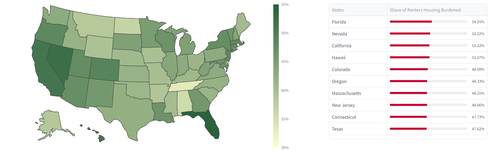
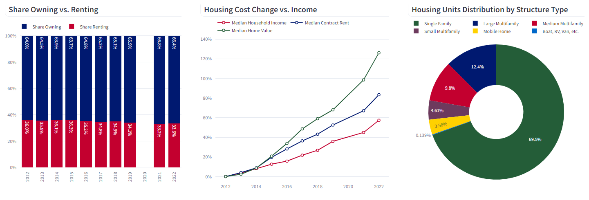
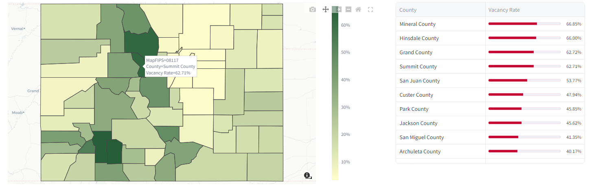

# Colorado Housing Dashboard

Welcome to my Colorado Housing Dashboard project! This project is a web-based dashboard application built with [Streamlit](https://streamlit.io/), using data from the U.S. Census Bureau's American Community Survey (ACS) 1-year and 5-year estimates, which provide detailed population, income, and housing information.

## Table of Contents
- [Features](#features)
- [Term Sheet](#term-sheet)
- [Screenshots](#screenshots)
- [Local Installation](#local-installation)

## Features
- **Interactive Visualizations**: Explore and compare data through maps, graphs, and other visual tools.
- **Real-time Data**: This dashboard is fed by the Census Bureau's APIs, enabling accurate, up-to-date access to housing data.
- **User-friendly Interface**: Easy-to-use interface with intuitive controls and ADA-compliant visualizations.
- **Open Access**: The code and dashboard are publicly available, and all charts and tables can be exported by any user.

## Term Sheet
To ensure a clear understanding of the housing data presented in this dashboard, we have included a term sheet. This term sheet explains common housing data terms used by the Census, such as "housing burden," which refers to spending more than 30% of one’s income on housing. These definitions will help you better interpret the data and insights provided by the dashboard.

1. **Contract Rent:** The monthly rental cost specified in a lease agreement, excluding other rental costs like utilities.
2. **Gross Rent:** Contract rent plus other rental costs like utilities, used to calculate housing burden.
3. **Housing Burdened:** A household is said to be housing burdened when it spends more than 30% of its income on housing.
4. **Tenure:** Refers to whether a housing unit is owner-occupied or renter-occupied.

## Screenshots
Below is a preview of the kinds of visualizations you will find in this dashboard:

1. **Share of Renters Housing Burdened by State**
   
   <br><br>
2. **Colorado Select Housing Metrics Summary**
   
   <br><br>
3. **Vacancy Rates by County**
   

## Local Installation
To run this dashboard locally, follow these steps:

1. **Clone the Repository**
    ```sh
    git clone https://github.com/rd-wendling/colorado-housing-dashboard.git
    cd colorado-housing-dashboard
    ```

2. **Install Dependencies**
    Make sure you have Python installed (this was created using version 3.11). Then, install the required Python packages:
    ```sh
    pip install -r requirements.txt
    ```

3. **Run the Application**
    ```sh
    streamlit run app.py
    ```

Once the application is running, open your web browser and navigate to `http://localhost:8501` to view the dashboard.

### Command Line Options
- `--server.port`: Specify the port to run the application (default is 8501).
- `--server.headless`: Run the server in headless mode (useful for deployment).
